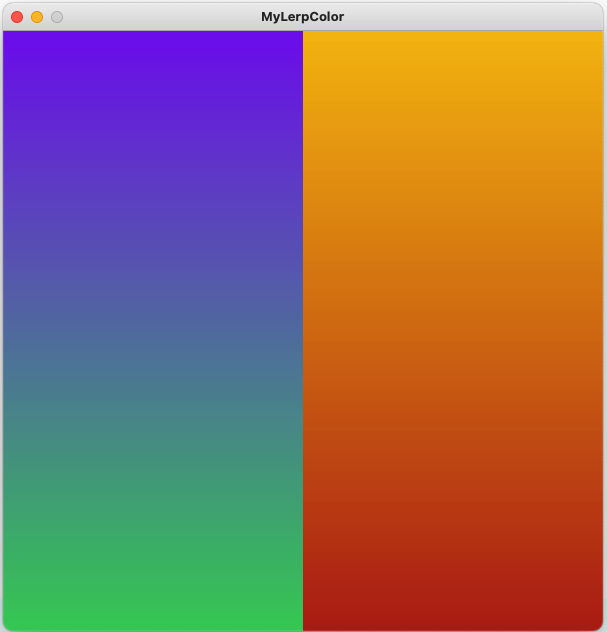
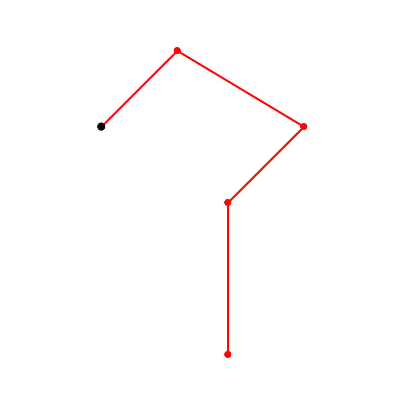

# Tarea 04. Álgebra y Rangos.

### Instrucciones

Esta tarea se divide en 4 secciones: [Álgebra](#algebra), [Normalización](#normalizacion), [Interpolación](#interpolacion) y [Mapeo](#mapeo).

Cada una de estas secciones tiene ejercicios:

- Las respuestas de esta tarea se debe subir a Brightspace.
- Los ejercicios marcados como `js`, se deben responder con un enlace de [https://codesandbox.io/](CodeSandbox).
- En caso contrario, se debe subir un archivo o texto respondiendo lo que se pida.
- Tienes prohibido usar las funciones `norm`, `lerp` o `map` en los sketches.

En caso de tener alguna duda, no olvides enviar un correo.

## Algebra

1. Despeja a `x` de las siguientes expresiones. DEBES indicar cuáles reglas del álgebra se ocupan en cada paso.
  * 
  * 
2. `js`. En base en este [sketch](https://codesandbox.io/s/aspect-ratio-mo8kqy?file=/sketch.js) donde se despliegue el [video](video.mp4) en un contenedor rectangular. Se puede elegir entre rellenar todo el contenedor, o hacer que se ajuste al contenedor. El contenedor puede cambiar su posición y su tamaño.

## Normalización

1. Normaliza los siguientes valores en los rangos correspondientes.
  * `x = 4`, `rango = [-10, 17]`
  * `x = 32`, `rango = [30, 190]`
2. Normaliza la siguiente lista de valores: `(-10, 9, -1, 10, 4, 0, -5)`.
3. Explica que pasa cuando normalizas un valor que no está dentro del rango. Usa estos ejemplos para explicar:
  * `x = 75`, `rango = [25, 50]`
  * `x = 2.5`, `rango = [5, 10]`

## Interpolación

1. Encuentra el valor que corresponde con el porcentaje `t` de cada rango (es decir, interpola):
  * `t = 0.25`, `rango = [100, 250]`
  * `t = 0.6`, `rango = [-100, 40]`
  * `t = 0.01`, `rango = [0, 104]`
2. `js`. Basándote en el [sketch](https://codesandbox.io/s/mylerpcolor-ge4q4p?file=/sketch.js) implementa la función `myLerpColor`. Esta función interpola dos colores y regresa un color que es la mezcla de ellos bajo cierta proporción. (Ver [`lerpColor`](https://p5js.org/reference/#/p5/lerpColor)). Para probar tu función, crea dos gradientes verticales de colores.

3. `js`. En el sketch `lerp/DottedLine/DottedLine.pde` implementa la función `dottedLine`. La función debe dibujar una linea punteada entre dos extremos, la separación entre cada punto esta indicado por un porcentaje.

## Mapeo

1. Encuentra el mapeo del valor `x` de un rango en el otro:
  * `x = 8` del rango: `[5, 30]`, al rango: `[-10, 9]`.
  * `x = 0` del rango: `[-1, 1]`, al rango: `[100, 300]`.
  * `x = 212` del rango: `[20, 850]`, al rango: `[-10, -3]`.
2. `js`. En el [sketch](https://codesandbox.io/s/pointonpath-69l633) hay 5 puntos con sus coordenadas x, y. Estos puntos definen un camino. Usa un número `t` para controlar la posición de un marcador negro sobre el camino.

  * Cuando `t` es `0.0`, el marcador negro esta sobre el primer punto.
  * Cuando `t` es `0.25`, el marcador negro esta a un cuarto del camino.
  * Cuando `t` es `1.0`, el marcador negro esta en el ultimo punto.

Happy Hacking! :D
